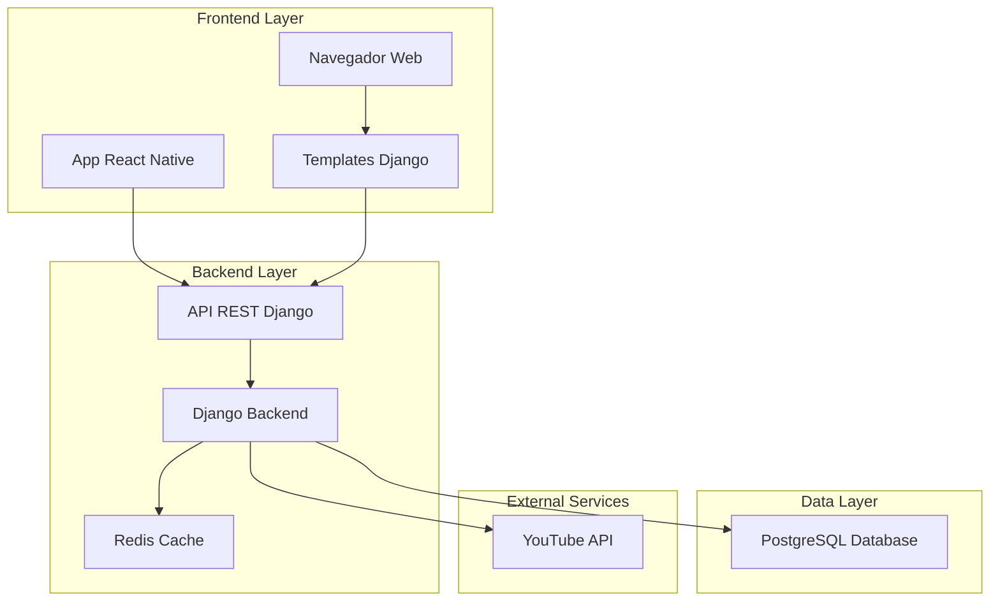
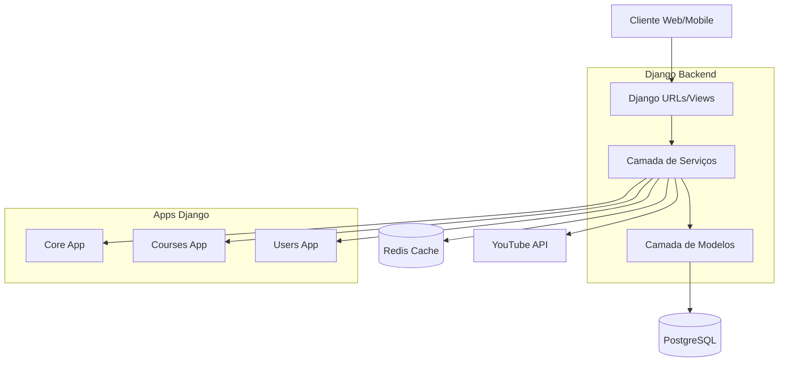
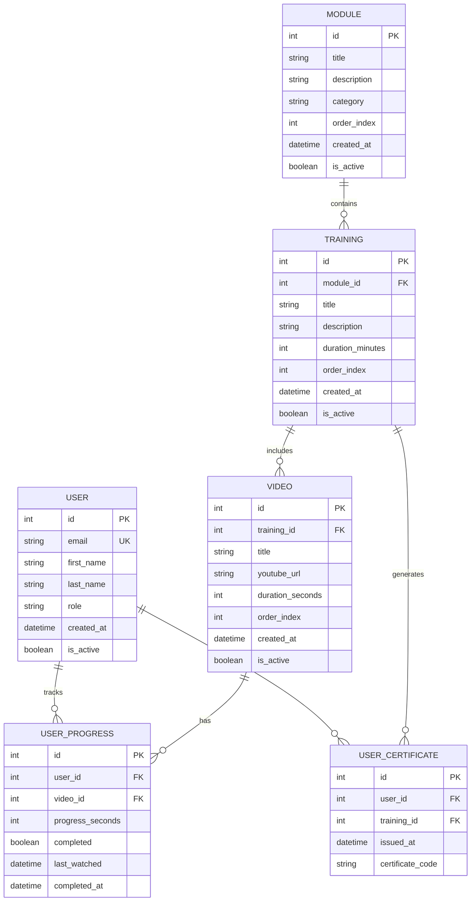

# Documento de Arquitetura Técnica - Sistema de Treinamento Corporativo SPS

## 1. Design da Arquitetura



## 2. Descrição das Tecnologias

- **Backend**: Django@4.2 + Django REST Framework@3.14 + PostgreSQL@15
- **Frontend Web**: Django Templates + Bootstrap@5.3 + JavaScript ES6
- **Mobile**: React Native@0.72 + JavaScript (não TypeScript)
- **Cache**: Redis@7.0
- **Autenticação**: Django Authentication + JWT para API
- **Player de Vídeo**: YouTube IFrame API

## 3. Definições de Rotas

### Rotas Web (Django Templates)
| Rota | Propósito |
|------|-----------|
| / | Página inicial com dashboard e navegação principal |
| /login | Página de autenticação de usuários |
| /logout | Logout e redirecionamento |
| /modules | Listagem de módulos de treinamento |
| /modules/<int:id> | Detalhes de um módulo específico |
| /training/<int:id> | Página de treinamento com lista de vídeos |
| /video/<int:id> | Player de vídeo com controles personalizados |
| /profile | Perfil do usuário e histórico de treinamentos |
| /admin-dashboard | Dashboard administrativo (apenas admins) |

### Rotas Mobile (React Native Navigation)
| Rota | Propósito |
|------|-----------|
| /Home | Tela inicial com módulos em destaque |
| /Login | Tela de autenticação |
| /Modules | Lista de módulos com navegação hierárquica |
| /Training | Detalhes do treinamento selecionado |
| /VideoPlayer | Player de vídeo em tela cheia |
| /Profile | Perfil e progresso do usuário |
| /Search | Tela de busca e filtros |

## 4. Definições da API

### 4.1 API Principal

**Autenticação de usuários**
```
POST /api/auth/login
```

Request:
| Nome do Parâmetro | Tipo | Obrigatório | Descrição |
|-------------------|------|-------------|-----------|
| email | string | true | Email corporativo do usuário |
| password | string | true | Senha do usuário |

Response:
| Nome do Parâmetro | Tipo | Descrição |
|-------------------|------|-----------|
| access_token | string | Token JWT para autenticação |
| refresh_token | string | Token para renovação |
| user | object | Dados básicos do usuário |

Exemplo:
```json
{
  "email": "funcionario@empresa.com",
  "password": "senha123"
}
```

**Listagem de módulos**
```
GET /api/modules
```

Response:
| Nome do Parâmetro | Tipo | Descrição |
|-------------------|------|-----------|
| id | integer | ID único do módulo |
| title | string | Título do módulo |
| description | string | Descrição do módulo |
| category | string | Categoria do módulo |
| total_videos | integer | Número total de vídeos |
| user_progress | float | Progresso do usuário (0-100) |

**Detalhes do treinamento**
```
GET /api/training/<int:id>
```

Response:
| Nome do Parâmetro | Tipo | Descrição |
|-------------------|------|-----------|
| id | integer | ID do treinamento |
| title | string | Título do treinamento |
| videos | array | Lista de vídeos do treinamento |
| duration | integer | Duração total em minutos |
| prerequisites | array | Pré-requisitos necessários |

**Progresso do usuário**
```
POST /api/progress
```

Request:
| Nome do Parâmetro | Tipo | Obrigatório | Descrição |
|-------------------|------|-------------|-----------|
| video_id | integer | true | ID do vídeo |
| progress_seconds | integer | true | Progresso em segundos |
| completed | boolean | false | Se o vídeo foi concluído |

## 5. Diagrama da Arquitetura do Servidor



## 6. Modelo de Dados

### 6.1 Definição do Modelo de Dados



### 6.2 Linguagem de Definição de Dados

**Tabela de Usuários (users)**
```sql
-- Criar tabela de usuários
CREATE TABLE users (
    id SERIAL PRIMARY KEY,
    email VARCHAR(255) UNIQUE NOT NULL,
    password_hash VARCHAR(255) NOT NULL,
    first_name VARCHAR(100) NOT NULL,
    last_name VARCHAR(100) NOT NULL,
    role VARCHAR(20) DEFAULT 'employee' CHECK (role IN ('employee', 'instructor', 'admin')),
    is_active BOOLEAN DEFAULT TRUE,
    created_at TIMESTAMP WITH TIME ZONE DEFAULT NOW(),
    updated_at TIMESTAMP WITH TIME ZONE DEFAULT NOW()
);

-- Criar índices
CREATE INDEX idx_users_email ON users(email);
CREATE INDEX idx_users_role ON users(role);
```

**Tabela de Módulos (modules)**
```sql
-- Criar tabela de módulos
CREATE TABLE modules (
    id SERIAL PRIMARY KEY,
    title VARCHAR(200) NOT NULL,
    description TEXT,
    category VARCHAR(100) NOT NULL,
    order_index INTEGER DEFAULT 0,
    is_active BOOLEAN DEFAULT TRUE,
    created_at TIMESTAMP WITH TIME ZONE DEFAULT NOW(),
    updated_at TIMESTAMP WITH TIME ZONE DEFAULT NOW()
);

-- Criar índices
CREATE INDEX idx_modules_category ON modules(category);
CREATE INDEX idx_modules_order ON modules(order_index);
```

**Tabela de Treinamentos (trainings)**
```sql
-- Criar tabela de treinamentos
CREATE TABLE trainings (
    id SERIAL PRIMARY KEY,
    module_id INTEGER REFERENCES modules(id) ON DELETE CASCADE,
    title VARCHAR(200) NOT NULL,
    description TEXT,
    duration_minutes INTEGER DEFAULT 0,
    order_index INTEGER DEFAULT 0,
    is_active BOOLEAN DEFAULT TRUE,
    created_at TIMESTAMP WITH TIME ZONE DEFAULT NOW(),
    updated_at TIMESTAMP WITH TIME ZONE DEFAULT NOW()
);

-- Criar índices
CREATE INDEX idx_trainings_module_id ON trainings(module_id);
CREATE INDEX idx_trainings_order ON trainings(order_index);
```

**Tabela de Vídeos (videos)**
```sql
-- Criar tabela de vídeos
CREATE TABLE videos (
    id SERIAL PRIMARY KEY,
    training_id INTEGER REFERENCES trainings(id) ON DELETE CASCADE,
    title VARCHAR(200) NOT NULL,
    youtube_url VARCHAR(500) NOT NULL,
    duration_seconds INTEGER DEFAULT 0,
    order_index INTEGER DEFAULT 0,
    is_active BOOLEAN DEFAULT TRUE,
    created_at TIMESTAMP WITH TIME ZONE DEFAULT NOW(),
    updated_at TIMESTAMP WITH TIME ZONE DEFAULT NOW()
);

-- Criar índices
CREATE INDEX idx_videos_training_id ON videos(training_id);
CREATE INDEX idx_videos_order ON videos(order_index);
```

**Tabela de Progresso do Usuário (user_progress)**
```sql
-- Criar tabela de progresso
CREATE TABLE user_progress (
    id SERIAL PRIMARY KEY,
    user_id INTEGER REFERENCES users(id) ON DELETE CASCADE,
    video_id INTEGER REFERENCES videos(id) ON DELETE CASCADE,
    progress_seconds INTEGER DEFAULT 0,
    completed BOOLEAN DEFAULT FALSE,
    last_watched TIMESTAMP WITH TIME ZONE DEFAULT NOW(),
    completed_at TIMESTAMP WITH TIME ZONE,
    UNIQUE(user_id, video_id)
);

-- Criar índices
CREATE INDEX idx_user_progress_user_id ON user_progress(user_id);
CREATE INDEX idx_user_progress_video_id ON user_progress(video_id);
CREATE INDEX idx_user_progress_completed ON user_progress(completed);
```

**Dados Iniciais**
```sql
-- Inserir dados iniciais
INSERT INTO users (email, password_hash, first_name, last_name, role) VALUES
('admin@empresa.com', 'pbkdf2_sha256$...', 'Admin', 'Sistema', 'admin'),
('instrutor@empresa.com', 'pbkdf2_sha256$...', 'João', 'Silva', 'instructor');

INSERT INTO modules (title, description, category, order_index) VALUES
('Integração de Novos Funcionários', 'Módulo básico para novos colaboradores', 'Onboarding', 1),
('Segurança no Trabalho', 'Treinamentos obrigatórios de segurança', 'Segurança', 2),
('Desenvolvimento Técnico', 'Cursos de capacitação técnica', 'Técnico', 3);
```