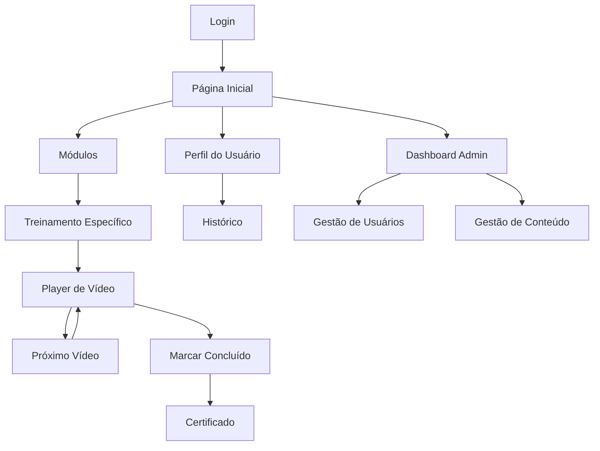

# Documento de Requisitos do Produto - Sistema de Treinamento Corporativo SPS

## 1. Visão Geral do Produto

Sistema completo de treinamento corporativo que oferece uma plataforma integrada web e mobile para gestão e consumo de conteúdo educacional interno da empresa. A solução permite que funcionários acessem treinamentos organizados hierarquicamente através de uma interface moderna em dark mode, com controle de progresso e sistema de busca avançado.

O produto visa centralizar todos os treinamentos corporativos em uma única plataforma, aumentando a eficiência do aprendizado e facilitando o acompanhamento do desenvolvimento profissional dos colaboradores.

## 2. Funcionalidades Principais

### 2.1 Papéis de Usuário

| Papel | Método de Registro | Permissões Principais |
|-------|-------------------|----------------------|
| Funcionário | Registro via email corporativo | Acesso a treinamentos, visualização de progresso, busca de conteúdo |
| Administrador | Convite do sistema | Gestão completa de usuários, módulos, treinamentos e relatórios |
| Instrutor | Designação por administrador | Criação e edição de conteúdo, acompanhamento de progresso dos alunos |

### 2.2 Módulo de Funcionalidades

Nossos requisitos do sistema de treinamento consistem nas seguintes páginas principais:

1. **Página Inicial**: dashboard de boas-vindas, navegação principal, módulos em destaque, progresso geral do usuário
2. **Página de Módulos**: listagem hierárquica de módulos, sistema de filtros, busca avançada
3. **Página de Treinamento**: detalhes do treinamento, lista de vídeos, progresso específico
4. **Player de Vídeo**: reprodução de conteúdo YouTube, controles personalizados, marcação de progresso
5. **Perfil do Usuário**: informações pessoais, histórico de treinamentos, certificados
6. **Página de Login**: autenticação de usuários, recuperação de senha
7. **Dashboard Administrativo**: gestão de usuários, módulos, relatórios de progresso

### 2.3 Detalhes das Páginas

| Nome da Página | Nome do Módulo | Descrição da Funcionalidade |
|----------------|----------------|----------------------------|
| Página Inicial | Dashboard Principal | Exibir módulos em destaque, progresso geral, navegação rápida para treinamentos recentes |
| Página Inicial | Menu de Navegação | Dropdown hierárquico com módulos e subtreinamentos, busca rápida |
| Página de Módulos | Lista de Módulos | Exibir módulos organizados por categoria, filtros por departamento/nível |
| Página de Módulos | Sistema de Busca | Buscar por título, tags, instrutor, filtrar por status de conclusão |
| Página de Treinamento | Detalhes do Curso | Mostrar descrição, objetivos, duração estimada, pré-requisitos |
| Página de Treinamento | Lista de Vídeos | Exibir sequência de vídeos, status de conclusão, tempo assistido |
| Player de Vídeo | Reprodutor YouTube | Integrar player YouTube, controles personalizados, marcação automática de progresso |
| Player de Vídeo | Controles de Progresso | Salvar posição atual, marcar como concluído, próximo vídeo automático |
| Perfil do Usuário | Informações Pessoais | Editar dados do usuário, preferências de notificação |
| Perfil do Usuário | Histórico de Treinamentos | Listar treinamentos concluídos, em andamento, certificados obtidos |
| Login | Autenticação | Login com email corporativo, recuperação de senha, lembrar usuário |
| Dashboard Admin | Gestão de Usuários | Criar, editar, desativar usuários, atribuir papéis |
| Dashboard Admin | Gestão de Conteúdo | Criar módulos, adicionar vídeos, organizar hierarquia |

## 3. Processo Principal

### Fluxo do Funcionário:
O funcionário acessa a plataforma, faz login com suas credenciais corporativas, navega pelos módulos disponíveis usando o sistema de dropdown hierárquico, seleciona um treinamento específico, assiste aos vídeos em sequência com o player integrado, e tem seu progresso automaticamente salvo. Pode pausar e retomar de onde parou, buscar conteúdo específico e acompanhar seu desenvolvimento no perfil.

### Fluxo do Administrador:
O administrador acessa o dashboard administrativo, gerencia usuários e suas permissões, cria e organiza módulos de treinamento, adiciona URLs de vídeos do YouTube, define a hierarquia de conteúdo, acompanha relatórios de progresso dos funcionários e gera certificados de conclusão.

## 4. Design da Interface do Usuário

### 4.1 Estilo de Design

- **Cores Primárias**: #1a1a1a (fundo principal), #2d2d2d (cards/containers), #3a3a3a (elementos interativos)
- **Cores Secundárias**: #4a90e2 (links/botões primários), #50c878 (sucesso/progresso), #ff6b6b (alertas)
- **Estilo de Botões**: Bordas arredondadas (8px), efeito hover suave, gradiente sutil em botões primários
- **Fontes**: Inter ou Roboto, tamanhos 14px (corpo), 18px (subtítulos), 24px (títulos)
- **Layout**: Design baseado em cards, navegação superior fixa, sidebar retrátil para mobile
- **Ícones**: Feather Icons ou Material Icons, estilo minimalista, cor #ffffff com opacidade 0.8

### 4.2 Visão Geral do Design das Páginas

| Nome da Página | Nome do Módulo | Elementos da UI |
|----------------|----------------|-----------------|
| Página Inicial | Dashboard | Cards com gradiente escuro, grid responsivo 3x2, ícones coloridos para cada módulo |
| Página Inicial | Menu de Navegação | Dropdown animado, fundo semi-transparente, hierarquia visual com indentação |
| Player de Vídeo | Controles | Overlay escuro, botões circulares, barra de progresso customizada em azul |
| Perfil do Usuário | Cards de Progresso | Barras de progresso animadas, badges de certificação, layout em duas colunas |
| Dashboard Admin | Tabelas de Dados | Tabelas com zebra striping, filtros inline, botões de ação coloridos |

### 4.3 Responsividade

O produto é desenvolvido com abordagem mobile-first, garantindo experiência otimizada tanto para desktop quanto para dispositivos móveis. A versão web adapta-se automaticamente a diferentes tamanhos de tela, enquanto o aplicativo React Native oferece interações touch otimizadas e navegação nativa. O dark mode é consistente entre todas as plataformas, mantendo a identidade visual unificada.